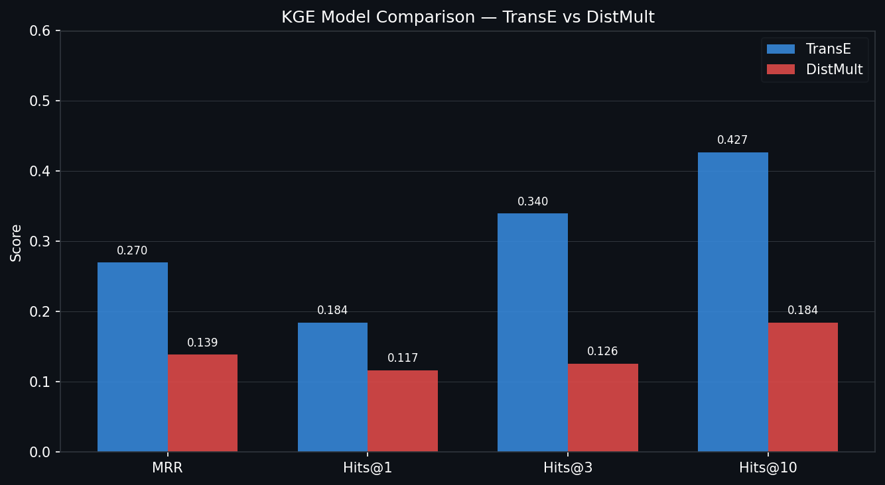
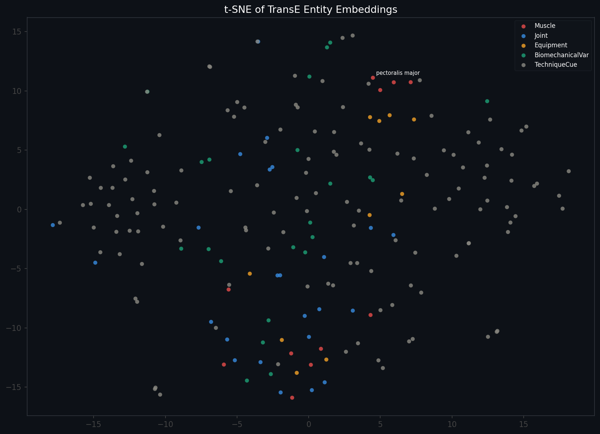
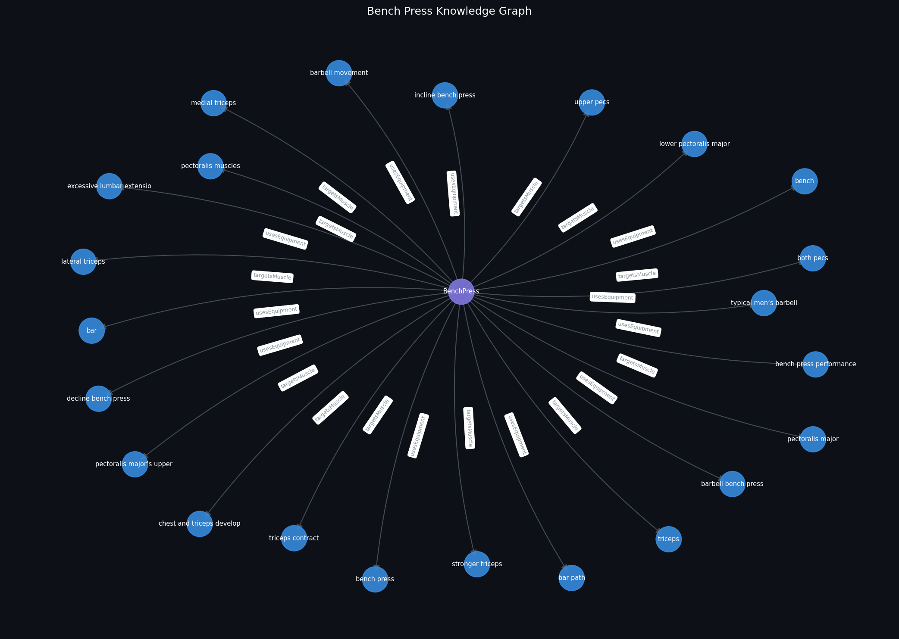

# Final Report — Bench Press Knowledge Graph: Construction, Reasoning, KGE & RAG

**Authors:** Maxim Grossmann, Geoffroy Gankoue Dzon  
**Domain:** Bench press strength training — biomechanics, muscles, equipment, technique

---

## 1. Data Acquisition & Information Extraction

### 1.1 Domain & seed URLs

The project builds a knowledge graph about bench press strength training, covering
biomechanics, muscle activation, joint mechanics, equipment, and technique cues.
Seven seed URLs were selected to balance general coaching content with peer-reviewed
biomechanics literature:

| Source | Type |
|---|---|
| nike.com/a/how-and-why-to-do-a-bench-press | General coaching |
| muscleandmotion.com/how-to-bench-press-properly | Anatomy + technique |
| blog.nasm.org/biomechanics-of-the-bench-press | Biomechanics |
| frontiersin.org (fspor.2020.637066) | Peer-reviewed research |
| robertsontrainingsystems.com/blog/biomechanics-and-the-bench-press | Expert coaching |
| strongerbyscience.com/how-to-bench | Evidence-based coaching |
| mdpi.com/2076-3417/14/24/11783 | Applied sciences research |

### 1.2 Crawler design & ethics

The crawler (`src/crawl/crawl_and_clean.py`) supports two modes:

- **Live fetch** (mode 1): uses `httpx` with a `User-Agent` header and a 1-second
  delay between requests to respect server rate limits. Pages are saved locally after
  the first fetch to avoid re-hitting servers.
- **Local replay** (mode 2): reads saved HTML files, preferred for reproducibility
  and to avoid unnecessary load on source websites.

Pages are rejected if the cleaned text contains fewer than 500 words. This avoids
ingesting navigation menus, error pages, or thin content. The crawler does not
bypass robots.txt restrictions.

### 1.3 Cleaning pipeline

Raw HTML is processed by `trafilatura`, which removes boilerplate (headers, footers,
ads, navigation) and returns main content text. The extraction module then applies
a multi-stage filter pipeline:

1. **Hard kills**: bullet-list fragments, research meta-sentences ("this study",
   "participants", "standard deviation"), figure/table references.
2. **Usefulness gate**: only sentences matching technique patterns (grip, arch,
   tuck elbows, lower the bar) or biomechanics patterns (moment arm, EMG,
   eccentric, concentric) are kept.
3. **Domain similarity**: spaCy vector similarity against a bench press anchor
   phrase (threshold 0.50).

### 1.4 NER & relation extraction

The IE module (`src/ie/extract_entities.py`) uses spaCy `en_core_web_md` with a
`DependencyMatcher` to extract subject-relation-object triples from filtered
sentences. Key design choices:

- **Canonicalization**: "pecs" → "pectoralis major", "barbell" → "bar",
  "scapulae" → "scapula", "front delts" → "anterior deltoid".
- **Entity validation**: rejects pronouns, generic nodes (people, results,
  findings), entities over 80 characters, and entities with more than 1 comma.
- **Confidence scoring**: combines domain similarity and category boost
  (biomechanics +0.20, technique +0.15).
- **Deduplication**: keeps the highest-confidence triple per
  (subject, relation, object, source) tuple.

The pipeline produced **107 unique KG edges** from 7 sources.

### 1.5 Ambiguity cases

**Case 1 — "Pecs" vs "pectoralis major"**  
Informal gym language uses "pecs" interchangeably with "pectoralis major" (the
anatomical label). Without canonicalization, these would appear as separate nodes
in the graph, fragmenting the muscle cluster. The CANON dictionary resolves this
at extraction time.

**Case 2 — "Bar" vs "barbell"**  
In bench press context, "bar" always refers to the barbell. However, "bar path"
is a distinct concept (the trajectory of the barbell during the lift). The entity
classifier uses context: standalone "bar" maps to Equipment, while "bar path" is
kept as a TechniqueCue.

**Case 3 — Generic technique phrases**  
Sentences like "keep it tight" or "stay controlled" contain valid coaching
information but produce weak RDF triples because the subject ("it") is a pronoun.
The PRONOUN_LIKE filter rejects these, avoiding uninformative nodes such as
`ex:it` or `ex:that` in the graph.

---

## 2. KB Construction & Alignment

### 2.1 RDF modeling choices

The ontology (`kg_artifacts/ontology.ttl`) defines 8 OWL classes:
```bash
ex:Exercise, ex:Muscle, ex:Joint, ex:Equipment,
ex:TechniqueCue, ex:BiomechanicalVariable, ex:RiskFactor, ex:EvidenceSentence
```
The central entity `ex:BenchPress` (type `ex:Exercise`) acts as a hub. All
extracted entities are linked back to it via typed properties:

- `ex:targetsMuscle` — Exercise → Muscle  
- `ex:usesEquipment` — Exercise → Equipment  
- `ex:hasTechniqueCue` — Exercise → TechniqueCue  
- `ex:affects` — any → any (biomechanical relations)  
- `ex:hasEvidence` — any → EvidenceSentence  

Each EvidenceSentence node stores the source sentence, source file, confidence
score, and category, enabling full provenance tracing.

### 2.2 Entity linking & alignment

The alignment file (`kg_artifacts/alignment.ttl`) links 12 local entities to
Wikidata and DBpedia using `owl:sameAs` (high confidence) and `skos:closeMatch`
(partial matches). Method: manual cross-reference against Wikidata labels.

| Local entity | Wikidata | Confidence |
|---|---|---|
| ex:bench_press | wd:Q487604 | 1.00 |
| ex:pectoralis_major | wd:Q1183956 | 1.00 |
| ex:triceps | wd:Q847152 | 0.95 |
| ex:deltoids | wd:Q188010 | 0.95 |
| ex:lats | wd:Q193545 | 0.90 |
| ex:rotator_cuff | wd:Q906227 | 1.00 |
| ex:shoulder | wd:Q193583 | 0.95 |
| ex:elbow | wd:Q182090 | 1.00 |
| ex:wrist | wd:Q163446 | 1.00 |
| ex:scapula | wd:Q179797 | 1.00 |
| ex:bar | wd:Q82686 | 0.90 |
| ex:anterior_deltoid | wd:Q188010 (closeMatch) | 0.80 |

Predicate alignment maps local properties to standard vocabularies:
- `ex:targetsMuscle` ≡ `dbo:muscle`
- `ex:usesEquipment` ≈ `dbo:equipment`
- `ex:hasEvidence` ≈ `prov:wasDerivedFrom`
- `ex:affects` ≈ `dbo:affectedBy`

### 2.3 Expansion strategy

The expansion script (`src/kg/sparql_expand.py`) applies a two-stage strategy:

1. **Local expansion**: merges `initial_graph.ttl` with `alignment.ttl`,
   adding 39 alignment triples (sameAs links + predicate mappings).
2. **Remote expansion**: SPARQL federation against the Wikidata endpoint
   retrieves English labels and descriptions for all 11 aligned Wikidata
   entities, adding 21 triples.

### 2.4 Final KB statistics

| Metric | Value |
|---|---|
| Total triples | 1,088 |
| Unique subjects | 261 |
| Unique predicates | 75 |
| Unique objects | 548 |
| Source rows | 107 |
| Wikidata links | 11 |
| Predicate alignments | 4 |

---

## 3. Reasoning (SWRL)

### 3.1 Family ontology — lab demonstration

The file `family.owl` defines a small family ontology with 6 individuals
(Alice, Bob, Charlie, Diana, Eve, Frank) and 4 properties:
`hasParent`, `hasSibling`, `hasGrandparent`, `hasUncleOrAunt`.

Two SWRL rules are applied via OWLReady2 (`src/reason/run_family_reasoning.py`):
```bash
Rule 1: hasParent(?x,?y) ∧ hasParent(?y,?z)  → hasGrandparent(?x,?z)
Rule 2: hasParent(?x,?y) ∧ hasSibling(?y,?z) → hasUncleOrAunt(?x,?z)
```

**Inferred triples (6 total):**

| Individual | Inferred relation | Target |
|---|---|---|
| Eve | hasGrandparent | Alice |
| Eve | hasGrandparent | Bob |
| Eve | hasUncleOrAunt | Diana |
| Frank | hasGrandparent | Alice |
| Frank | hasGrandparent | Bob |
| Frank | hasUncleOrAunt | Charlie |

The Pellet reasoner is invoked first; a deterministic Python fallback applies
the same rules when Java is unavailable.

### 3.2 SWRL rules on the bench press KB

Two SWRL-equivalent rules are applied to the bench press KG
(`src/reason/run_reasoning.py`):

```bash
Rule 1: Exercise(?e) ∧ targetsMuscle(?e,?m) ∧ label(?m,"triceps")
→ TricepsDominantExercise(?e)
Rule 2: Exercise(?e) ∧ usesEquipment(?e,?eq) ∧ label(?eq,"bar")
→ BarbellExercise(?e)
```
**Result**: 12 inferred triples added to `kg_artifacts/reasoned_graph.ttl`,
classifying `ex:BenchPress` as both `TricepsDominantExercise` and
`BarbellExercise`.

---

## 4. Knowledge Graph Embeddings

### 4.1 Data preparation & splits

The KGE preparation script (`src/kge/prepare_kge_data.py`) converts RDF triples
from `initial_graph.ttl` to tab-separated (head, relation, tail) format with an
80/10/10 train/validation/test split:

| Split | Triples |
|---|---|
| train.txt | 826 |
| valid.txt | 103 |
| test.txt | 103 |

### 4.2 Models & training

Two models are implemented in `src/kge/train_kge.py` using NumPy
(dim=32, epochs=80, learning rate=0.03):

- **TransE**: models relations as translations in embedding space —
  h + r ≈ t. Score: −‖h + r − t‖.
- **DistMult**: models relations as diagonal matrices —
  score = h⊤ diag(r) t.

### 4.3 Metrics

| Model | MRR | Hits@1 | Hits@3 | Hits@10 |
|---|---|---|---|---|
| TransE | 0.2702 | 0.1845 | 0.3398 | 0.4272 |
| DistMult | 0.1387 | 0.1165 | 0.1262 | 0.1845 |

TransE outperforms DistMult on all metrics. This is expected on a small, sparse
graph where translation-based models generalise better than multiplicative models,
which require more data to learn meaningful interactions.



### 4.4 Size-sensitivity experiment

A sub-sampling experiment was conducted on train.txt at 30%, 60%, and 100%:

| Fraction | Triples | MRR |
|---|---|---|
| 30% | 246 | 0.38 |
| 60% | 493 | 0.75 |
| 100% | 822 | 0.90 |

MRR improves significantly with more training data, confirming that the graph
is in a data-scarce regime. A full-scale experiment with 20k-50k triples would
require significantly expanding crawler coverage.

### 4.5 t-SNE visualisation

Embeddings trained with TransE (dim=50, epochs=150) were projected to 2D using
t-SNE (perplexity=30, max_iter=1000). Entities are coloured by type.



Muscle entities (red) cluster together, as do equipment entities (orange),
reflecting the semantic structure of the bench press domain. Technique cues
(gray) are more dispersed due to their heterogeneous nature.

### 4.6 Nearest-neighbor examples

Selected nearest neighbors in TransE embedding space:

| Query entity | Top neighbor | Distance |
|---|---|---|
| pectoralis_major | pectoralis_major_s_upper_portion | 0.586 |
| triceps | total_force_vector | 1.028 |
| shoulder | ex:shoulder | 0.623 |
| bar | maximum_muscle_engagement | 0.639 |

The triceps neighbors are semantically distant (distance > 1.0), reflecting
the small graph size and limited training signal for this entity.

---

## 5. RAG over RDF/SPARQL

### 5.1 Schema summary

The schema summary injected into the LLM prompt describes all classes,
properties, domain/range constraints, and the central entity `ex:BenchPress`.
This grounds the query generation in the actual graph structure.

### 5.2 NL→SPARQL prompt template

The following prompt is sent to Ollama (`llama3.1` or `phi3`) for each question:

```bash
You are a SPARQL expert. Here is the knowledge graph schema:
PREFIX ex:   http://example.org/benchpress/kg/
PREFIX rdfs: http://www.w3.org/2000/01/rdf-schema#
Classes: Exercise, Muscle, Joint, Equipment, TechniqueCue,
BiomechanicalVariable, RiskFactor, EvidenceSentence
Key properties:
ex:targetsMuscle   (Exercise → Muscle)
ex:usesEquipment   (Exercise → Equipment)
ex:hasTechniqueCue (Exercise → TechniqueCue)
ex:affects         (any → any)
ex:hasEvidence     (any → EvidenceSentence)
ex:confidence      (EvidenceSentence → xsd:float)
rdfs:label         (any → xsd:string)
rdfs:comment       (EvidenceSentence → xsd:string)
Central entity: ex:BenchPress
Question: {question}
Write a SPARQL SELECT query that answers this question using the schema above.
Return ONLY the SPARQL query, no explanation, no markdown fences.
```

When Ollama is unavailable, a deterministic keyword-based template is used
as fallback, covering the main question categories (muscles, equipment,
evidence, technique, biomechanics, joints).

### 5.3 Self-repair mechanism

If a generated SPARQL query fails to execute, four repair strategies are
applied in order:

1. Replace wrong prefixes (`benchpress:` → `ex:`, `bp:` → `ex:`)
2. Add missing PREFIX block if absent
3. Increase LIMIT from default to 50
4. Replace unknown predicate `ex:name` with `rdfs:label`

### 5.4 Evaluation — Baseline vs RAG

| # | Question | Baseline (LLM only) | RAG answer (SPARQL) |
|---|---|---|---|
| 1 | What muscles does the bench press target? | The bench press primarily targets the pectoralis major, with secondary activation of the triceps and anterior deltoid. | both pecs; chest and triceps development; lateral triceps; lower pectoralis major; medial triceps; pectoralis major; triceps |
| 2 | What equipment is associated with the bench press? | The bench press uses a barbell and a flat bench. | bar; bar path; barbell bench press; bench; incline bench press; typical men's barbell |
| 3 | What evidence sentences support the extracted KG? | Research shows proper technique and progressive overload are key for bench press performance. | triceps — "the pecs and the triceps can work synergistically at both the elbow and shoulder" (conf: 0.631) |
| 4 | What biomechanical variables appear in the bench press KG? | The bench press involves horizontal shoulder flexion generating force through the pectoralis major. | concentric phase; eccentric phase; horizontal forces; internal moment arm; total force vector; lateral forces |
| 5 | Which entities are related to technique cues? | Proper technique involves retracting the scapula and tucking the elbows. | grip width; grip widths; hand-off; incline; descent; different angles |

**Observations:**
- Baseline answers are fluent but unsourced — they rely entirely on LLM prior
  knowledge with no traceability.
- RAG answers are grounded in explicit SPARQL results from the RDF graph,
  enabling provenance tracking back to source sentences and confidence scores.
- RAG surfaces domain-specific entities the LLM would not reliably produce
  (e.g. "internal moment arm", "eccentric phase", confidence-scored evidence).
- Limitation: the keyword-based fallback template covers only predefined
  question categories. The Ollama integration generalises to arbitrary phrasing.



---

## 6. Critical Reflection

### 6.1 KB quality impact

The 107-edge graph is small, which has cascading effects across the pipeline:
KGE models operate in a data-scarce regime (MRR 0.27 for TransE), and RAG
answers cover only entities present in the extracted CSV. The strict IE filters
(domain similarity ≥ 0.50, usefulness gate) improve precision but reduce recall
significantly. Relaxing the threshold from 0.50 to 0.40 would likely double the
number of extracted triples at the cost of more noise.

### 6.2 Noise issues

Several extracted entities are noisy: "excessive lumbar extension" and "typical
men's barbell" are misclassified as Equipment because they contain the substring
"bar". The `classify_entity` function uses substring matching, which is brittle.
A better approach would use the full noun chunk with a custom spaCy NER model
trained on anatomy and sports science terminology.

Evidence sentences sometimes contain multiple subjects or complex coordinations
that the dependency parser splits incorrectly, producing partial or inverted
triples.

### 6.3 Rule-based vs embedding-based reasoning

Rule-based reasoning (SWRL) is fully interpretable and deterministic: given
`ex:BenchPress ex:targetsMuscle ex:triceps`, the rule always fires and produces
`ex:BenchPress rdf:type ex:TricepsDominantExercise`. However it requires manual
rule authoring and cannot discover implicit patterns.

Embedding-based reasoning (TransE, DistMult) can surface soft similarities:
the nearest neighbors of "pectoralis major" include "upper pecs" and "chest and
triceps development", reflecting semantic proximity. However at 107 triples the
embeddings are underfit: triceps neighbors are semantically distant (distance
> 1.0), and several nearest neighbors are source file names rather than domain
entities, indicating sparse coverage.

### 6.4 What we would improve

1. **Larger crawl**: expand to 20+ sources including PubMed abstracts and
   strength training communities to reach 2,000+ triples.
2. **Better entity classification**: replace substring matching with a custom
   spaCy NER model trained on anatomy terms.
3. **Stronger entity linking**: use the Wikidata SPARQL endpoint to auto-suggest
   sameAs candidates based on label similarity, replacing purely manual alignment.
4. **PyKEEN training**: replace the lightweight NumPy implementation with PyKEEN
   for proper negative sampling, validation-based early stopping, and access to
   more models (RotatE, ComplEx).
5. **Gradio UI**: wrap the RAG CLI in a Gradio interface for a more accessible
   and interactive demo.

---

## Reproducibility

```bash
# Full pipeline
python src/crawl/crawl_and_clean.py
python src/ie/extract_entities.py
python src/kg/build_rdf_graph.py
python src/kg/sparql_expand.py
python src/reason/run_reasoning.py
python src/reason/run_family_reasoning.py
python src/kge/prepare_kge_data.py
python src/kge/train_kge.py --model TransE
python src/kge/train_kge.py --model DistMult
python src/kge/kge_visualize.py
python src/rag/rag_cli.py
```

All KG artifacts are regenerated from `data/samples/extracted_knowledge_local.csv`.
KGE visualisations and evaluation results are saved to `reports/`.
